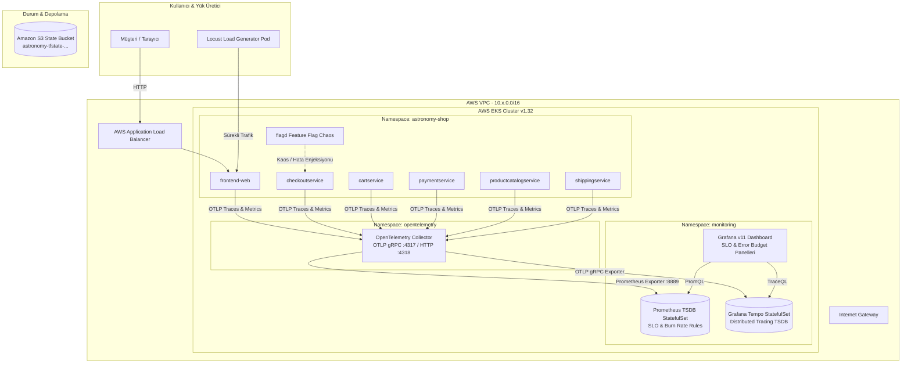

# 🔭 OpenTelemetry Astronomy Shop — Enterprise SRE, SLO/SLI & Distributed Tracing Platform


Bu proje; Cloud Native Computing Foundation (CNCF) resmi **OpenTelemetry Astronomy Shop** mikroservis mimarisini temel alan; AWS üzerinde modüler **Terraform (EKS & VPC)** altyapısıyla çalışan, Google SRE el kitabına uygun **Hizmet Seviyesi Hedefleri (SLO)**, **Hata Bütçesi (Error Budget)**, **Çok Pencereli Hızlı/Yavaş Tüketim (Multi-Window Multi-Burn-Rate) Alarmları** ve **Dağıtık İzleme (Distributed Tracing)** pratiklerini uçtan uca hayata geçiren kurumsal bir SRE ve Gözlemlenebilirlik platformudur.

---

## 📑 İçindekiler
1. [🏛️ AWS Mimarisi ve Telemetri Akışı](#️-aws-mimarisi-ve-telemetri-akışı)
2. [📐 SRE SLO/SLI Matematiksel Modeli](#-sre-slosli-matematiksel-modeli)
3. [📦 Modüler Terraform ve Çoklu Ortam Yapısı](#-modüler-terraform-ve-çoklu-ortam-yapısı)
4. [🚀 Adım Adım Kurulum ve Dağıtım Kılavuzu](#-adım-adım-kurulum-ve-dağıtım-kılavuzu)
   - [Adım 1: Ön Koşulların Doğrulanması](#adım-1-ön-koşulların-doğrulanması)
   - [Adım 2: AWS EKS ve VPC Altyapısının Kurulması](#adım-2-aws-eks-ve-vpc-altyapısının-kurulması)
   - [Adım 3: SRE ve Observability Yığınının Dağıtılması](#adım-3-sre-ve-observability-yığınının-dağıtılması)
   - [Adım 4: Astronomy Shop Mikroservislerinin Dağıtılması](#adım-4-astronomy-shop-mikroservislerinin-dağıtılması)
   - [Adım 5: Servis ve Dashboard Arayüzlerine Erişim](#adım-5-servis-ve-dashboard-arayüzlerine-erişim)
5. [🧪 Canlı Kaos Mühendisliği & Hata Bütçesi Yakma Deneyi](#-canlı-kaos-mühendisliği--hata-bütçesi-yakma-deneyi)
6. [🔍 Otomatik Doğrulama ve Testler](#-otomatik-doğrulama-ve-testler)
7. [🧹 Temizlik & Teardown (Maliyet Tasarrufu)](#-temizlik--teardown-maliyet-tasarrufu)
8. [🛠️ Sık Karşılaşılan Sorunlar ve Çözümleri](#️-sık-karşılaşılan-sorunlar-ve-çözümleri)

---

## 🏛️ AWS Mimarisi ve Telemetri Akışı

Altyapı; AWS üzerinde çift Kullanılabilirlik Alanında (Multi-AZ) konuşlanan VPC, genel ve özel alt ağlar, tekil NAT Gateway (maliyet optimizasyonu), Kubernetes v1.32 EKS Kümesi ve EC2 Managed Node Group bileşenlerinden oluşur.



---

## 📐 SRE SLO/SLI Matematiksel Modeli

Bu platform, Google SRE standartlarına uygun iki temel Hizmet Seviyesi Hedefi (SLO) uygular:

### 1. Erişilebilirlik Hedefi (Availability SLO: %99.9)
* **Hizmet Seviyesi Göstergesi (SLI):** Başarılı HTTP isteklerinin toplam isteklere oranıdır.
  $$\text{Availability SLI} = 1 - \frac{\sum \text{rate}(http\_requests\_total\{status=\sim"5.."\}[\text{30d}])}{\sum \text{rate}(http\_requests\_total[\text{30d}])}$$
* **Hata Bütçesi (Error Budget):** Toplam isteklerin azami `%0.1`'i (1.000 işlemde 1 hata) tolere edilir.

### 2. Gecikme Hedefi (Latency SLO: p95 < 500ms)
* **SLI:** Checkout ve kritik servis çağrılarının `%95`'inin 500 milisaniyenin altında tamamlanma oranıdır.
  $$\text{Latency SLI} = \text{histogram\_quantile}(0.95, \sum \text{rate}(http\_request\_duration\_seconds\_bucket\{job="checkoutservice"\}[5m]))$$

### 3. Çok Pencereli Tüketim Hızı Alarmları (Multi-Window Multi-Burn-Rate)
Geleneksel eşik alarmları yerine, hata bütçesinin tükenme hızına göre akıllı iki kademeli alarm mekanizması çalışır:
* 🚨 **Critical Burn Rate (14.4x Tüketim Hızı):** 1 saat içinde aylık hata bütçesinin `%2`'si tükeniyorsa derhal **Kritik Alarm (Pager)** üretilir.
* ⚠️ **Warning Burn Rate (6x Tüketim Hızı):** 6 saat içinde bütçenin `%5`'i tükeniyorsa mesai içi müdahale için **Uyarı Alarmı (Ticket)** üretilir.

---

## 📦 Modüler Terraform ve Çoklu Ortam Yapısı

Terraform kodları ortamdan bağımsız, tekrar kullanılabilir modüller halinde organize edilmiştir:

```text
terraform/
├── main.tf                    # VPC, EKS ve (opsiyonel) ECS modüllerini birleştiren ana orkestrasyon
├── variables.tf               # Çoklu ortam değişkenleri
├── outputs.tf                 # Cluster endpoint, VPC ID, subnet listeleri
├── backend.tf                 # Pure S3 Backend (DynamoDB gerektirmez)
├── environments/              # Ortam bazlı bağımsız değişkenler (-var-file)
│   ├── dev.tfvars             # Geliştirme (us-east-1, 2x t3.medium, 10.10.0.0/16)
│   ├── staging.tfvars         # Test Ortamı (us-east-1, 2x t3.medium, 10.20.0.0/16)
│   └── prod.tfvars            # Üretim Ortamı (us-east-1, 3x t3.large, 10.30.0.0/16)
└── modules/
    ├── vpc/                   # Multi-AZ VPC, Genel/Özel Subnetler, Tek NAT Gateway
    ├── eks/                   # AWS EKS v1.32, API_AND_CONFIG_MAP access_config, Managed Node Group
    └── ecs/                   # Opsiyonel AWS ECS Fargate modülü
```

---

## 🚀 Adım Adım Kurulum ve Dağıtım Kılavuzu

### Adım 1: Ön Koşulların Doğrulanması
Terminalinizde gerekli araçların yüklü olduğundan ve AWS kimlik bilgilerinizin aktif olduğundan emin olun:

```bash
# Araç sürümlerini kontrol edin
terraform version    # >= 1.5.0
aws --version        # >= 2.0
kubectl version --client
helm version

# AWS bağlantınızı test edin
aws sts get-caller-identity
```

### Adım 2: AWS EKS ve VPC Altyapısının Kurulması
Modüler Terraform altyapısını tek komutla ayağa kaldırın:

```bash
chmod +x scripts/*.sh

# Dev ortamı için altyapıyı dağıtın:
./scripts/deploy-aws-infra.sh dev
```

Bu betik otomatik olarak:
1. AWS hesabınıza özel şifreli ve versiyonlu **Amazon S3 State Bucket**'ını (`astronomy-tfstate-<ACCOUNT_ID>-dev`) oluşturur.
2. Terraform modüllerini init eder ve `dev.tfvars` ile onaylı provizyon yapar.
3. EKS kümesi oluştuktan sonra yerel `~/.kube/config` dosyanızı günceller ve worker node'ların hazır olduğunu doğrular:

```bash
kubectl get nodes -o wide
```

### Adım 3: SRE ve Observability Yığınının Dağıtılması
OpenTelemetry Collector, Prometheus StatefulSet, Grafana Tempo ve Grafana panolarını kurun:

```bash
./scripts/deploy-sre-platform.sh
```

Kurulum durumunu kontrol edin:
```bash
# İzleme StatefulSet'lerini ve servisleri kontrol edin
kubectl get statefulsets,pods,svc -n monitoring
kubectl get pods -n opentelemetry
```

### Adım 4: Astronomy Shop Mikroservislerinin Dağıtılması
Astronomy Shop mikroservisleri `deploy-sre-platform.sh` tarafından Helm ile otomatik dağıtılır. Pod durumlarını inceleyin:

```bash
kubectl get pods -n astronomy-shop
```
*(Tüm mikroservislerin `Running` durumuna geçmesi 2-3 dakika sürebilir).*

### Adım 5: Servis ve Dashboard Arayüzlerine Erişim

Terminalinizde port-forward komutlarını çalıştırarak arayüzlere bağlanabilirsiniz:

#### 1. Grafana SLO & Tracing Panosu:
```bash
kubectl port-forward svc/grafana -n monitoring 3000:3000
```
* **URL:** [http://localhost:3000](http://localhost:3000)
* **Kullanıcı:** `admin`
* **Şifre:** `BilgincIT454`
* **Pano Yolu:** *Dashboards -> E-Commerce SRE Service Level Objectives (SLO) & Error Budgets*

#### 2. Astronomy Shop E-Ticaret Arayüzü:
```bash
kubectl port-forward svc/astronomy-shop-frontend -n astronomy-shop 8080:8080
```
* **URL:** [http://localhost:8080](http://localhost:8080)

#### 3. Prometheus Arayüzü & Kural Kontrolü:
```bash
kubectl port-forward svc/prometheus -n monitoring 9090:9090
```
* **URL:** [http://localhost:9090/rules](http://localhost:9090/rules)

---

## 🧪 Canlı Kaos Mühendisliği & Hata Bütçesi Yakma Deneyi

Sistem üzerinde yapay arızalar oluşturarak SLO göstergelerinin, hata bütçesi ibrelerinin ve alarmların nasıl tetiklendiğini gözlemleyin:

```bash
./scripts/chaos-error-spike.sh
```

Bu senaryoda:
1. `checkoutservice` ve `paymentservice` uç noktalarına yapay HTTP 500 hataları ve yüksek gecikme enjekte edilir.
2. Grafana panosunda **Error Budget Remaining** değerinin azaldığı ve **Burn Rate** ibresinin kırmızı alana geçtiği canlı olarak izlenir.
3. Dağıtık izleme (Grafana Tempo) sekmesinde hata veren span'lar (kırmızı işaretli gRPC/HTTP izleri) kök neden analizi için incelenir.

---

## 🔍 Otomatik Doğrulama ve Testler

Tüm sistem bileşenlerinin uçtan uca sağlığını doğrulamak için doğrulama betiğini çalıştırın:

```bash
./scripts/validate.sh
```

Doğrulama kriterleri:
- [x] AWS EKS Worker Node'ları `Ready` durumunda
- [x] OpenTelemetry Collector OTLP dinleyicileri aktif (`:4317`, `:4318`)
- [x] Prometheus StatefulSet podları ve SLO kuralları yüklü
- [x] Grafana Tempo trace kayıt altyapısı çalışır durumda
- [x] Astronomy Shop web frontend ve mikroservisleri HTTP 200 yanıtı veriyor

---

## 🧹 Temizlik & Teardown (Maliyet Tasarrufu)

Çalışmanız tamamlandığında faturanın artmaması ve bulut kaynaklarının temizlenmesi için tek komutla tüm altyapıyı kaldırabilirsiniz:

```bash
./scripts/destroy-aws-infra.sh dev
```

Bu betik sırasıyla:
1. Kubernetes üzerindeki yük dengeleyicilerini (ELB/ALB) ve uygulamaları kaldırır.
2. Terraform ile EKS kümesini, Managed Node Group'u, NAT Gateway'i ve VPC'yi eksiksiz temizler.

---

## 🛠️ Sık Karşılaşılan Sorunlar ve Çözümleri

### 1. `kubectl get nodes` komutunda yetki hatası (Unauthorized / AccessDenied)
* **Sebep:** EKS v1.32 erişim izinlerinde creator kullanıcısının API_AND_CONFIG_MAP modunda yetkilendirilmemesi.
* **Çözüm:** `terraform/modules/eks/main.tf` içerisindeki `access_config` bloğunda `bootstrap_cluster_creator_admin_permissions = true` tanımlıdır. `aws eks update-kubeconfig --region us-east-1 --name astronomy-shop-dev` komutunu yeniden çalıştırın.

### 2. Podların `Pending` durumunda kalması (Insufficient CPU / Memory)
* **Sebep:** Kümeye tahsis edilen node kapasitesinin mikroservislerin varsayılan request limitlerine yetmemesi.
* **Çözüm:** `terraform/environments/dev.tfvars` dosyasında `node_instance_types = ["t3.medium"]` ve `desired_nodes = 2` olarak yapılandırılmıştır; bu kaynaklar tüm hafifletilmiş yığın için optimize edilmiştir.

### 3. S3 Bucket Adı Çakışması
* **Sebep:** S3 bucket adlarının küresel ölçekte benzersiz olması gerekliliği.
* **Çözüm:** Dağıtım betiklerimiz bucket adını dinamik olarak `astronomy-tfstate-${ACCOUNT_ID}-${ENV}` formatında ürettiğinden çakışma yaşanmaz.
