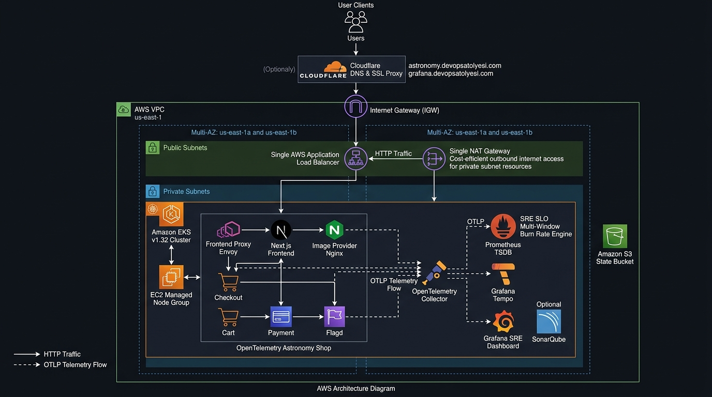

# 🔭 OpenTelemetry Astronomy Shop — Enterprise SRE, SLO/SLI & Distributed Tracing Platform



Bu proje; Cloud Native Computing Foundation (CNCF) resmi **OpenTelemetry Astronomy Shop** mikroservis mimarisini temel alan; AWS üzerinde modüler **Terraform (EKS & VPC)** altyapısıyla çalışan, Google SRE el kitabına uygun **Hizmet Seviyesi Hedefleri (SLO)**, **Hata Bütçesi (Error Budget)**, **Çok Pencereli Hızlı/Yavaş Tüketim (Multi-Window Multi-Burn-Rate) Alarmları** ve **Dağıtık İzleme (Distributed Tracing)** pratiklerini uçtan uca hayata geçiren kurumsal bir SRE ve Gözlemlenebilirlik platformudur.

---

## 📑 İçindekiler
1. [🏛️ AWS Mimarisi ve Telemetri Akışı](#️-aws-mimarisi-ve-telemetri-akışı)
2. [📐 SRE SLO/SLI Matematiksel Modeli](#-sre-slosli-matematiksel-modeli)
3. [📦 Modüler Terraform ve Çoklu Ortam Yapısı](#-modüler-terraform-ve-çoklu-ortam-yapısı)
4. [🚀 Adım Adım Kurulum ve Dağıtım Kılavuzu](#-adım-adım-kurulum-ve-dağıtım-kılavuzu)
   - [Adım 1: Ön Koşulların Doğrulanması](#adım-1-ön-koşulların-doğrulanması)
   - [Adım 2: AWS EKS ve VPC Altyapısının Kurulması](#adım-2-aws-eks-ve-vpc-altyapısının-kurulması)
   - [Adım 3: SRE ve Observability Yığınının Dağıtılması](#adım-3-sre-ve-observability-yığınının-dağıtılması)
   - [Adım 4: Astronomy Shop Mikroservislerinin Dağıtılması](#adım-4-astronomy-shop-mikroservislerinin-dağıtılması)
   - [Adım 5: Servis ve Dashboard Arayüzlerine Erişim](#adım-5-servis-ve-dashboard-arayüzlerine-erişim)
5. [🧪 Canlı Kaos Mühendisliği & Hata Bütçesi Yakma Deneyi](#-canlı-kaos-mühendisliği--hata-bütçesi-yakma-deneyi)
6. [🔍 Otomatik Doğrulama ve Testler](#-otomatik-doğrulama-ve-testler)
7. [🧹 Temizlik & Teardown (Maliyet Tasarrufu)](#-temizlik--teardown-maliyet-tasarrufu)
8. [🛠️ Sık Karşılaşılan Sorunlar ve Çözümleri](#️-sık-karşılaşılan-sorunlar-ve-çözümleri)

---

## 🏛️ AWS Mimarisi ve Telemetri Akışı

Altyapı; AWS üzerinde çift Kullanılabilirlik Alanında (Multi-AZ) konuşlanan VPC, genel ve özel alt ağlar, tekil NAT Gateway (maliyet optimizasyonu), Kubernetes v1.32 EKS Kümesi ve EC2 Managed Node Group bileşenlerinden oluşur.


1. **Giriş & Yönlendirme Katmanı (Ingress, DNS & Let's Encrypt SSL):**
   - **AWS Katmanı (Sıfır ACM):** AWS üzerinde ACM veya SSL terminasyonu yapılmaz; AWS Load Balancer sadece Port 80 ve Port 443 trafiğini Kubernetes Ingress-NGINX controller'a aktaran şeffaf bir köprüdür.
   - **Cloudflare Katmanı (Sadece DNS / proxied: false):** Cloudflare sadece DNS sağlayıcı olarak kullanılır (Gri Bulut / `proxied: false`). SSL/proxy modu kapalıdır; bu sayede Cloudflare proxy çakışmaları ve SSL döngüleri engellenir.
   - **Kubernetes & Let's Encrypt Katmanı:** Küme içinde çalışan `cert-manager`, Let's Encrypt ACME HTTP-01 protokolü ile `astronomy.devopsatolyesi.com` ve `grafana.devopsatolyesi.com` için 100% otomatik ve ücretsiz geçerli SSL/TLS sertifikalarını üretir. TLS terminasyonu doğrudan Ingress-NGINX seviyesinde gerçekleşir.
2. **Uygulama Katmanı (EKS Private Subnets):** Ingress Gateway gelen trafiği `astronomy-shop` namespace'i altındaki `frontend-proxy` (Envoy) ve Next.js mikroservislerine yönlendirir. Ürün görselleri `image-provider` (Nginx) tarafından sunulur.
3. **Telemetri & Gözlemlenebilirlik (LGTM Stack):** Tüm mikroservisler OpenTelemetry SDK ile enstrümante edilmiştir. Metrikler, loglar ve dağıtık izler (traces) `opentelemetry` namespace'indeki OTel Collector'a iletilir; oradan Prometheus TSDB ve Grafana Tempo'ya dağıtılır.
4. **SRE & SLO Motoru:** Prometheus TSDB üzerinde tanımlı çok pencereli tüketim kuralları hata bütçesini sürekli denetler ve Grafana SLO Dashboard'larında görselleştirilir.

---

## 📐 SRE SLO/SLI Matematiksel Modeli

Bu platform, Google SRE standartlarına uygun iki temel Hizmet Seviyesi Hedefi (SLO) uygular:

### 1. Erişilebilirlik Hedefi (Availability SLO: %99.9)
* **Hizmet Seviyesi Göstergesi (SLI):** Başarılı HTTP isteklerinin toplam isteklere oranıdır.
```promql
# Availability SLI (Son 30 Günlük Başarı Oranı)
1 - (sum(rate(http_requests_total{status=~"5.."}[30d])) / sum(rate(http_requests_total[30d])))
```
* **Hata Bütçesi (Error Budget):** Toplam isteklerin azami `%0.1`'i (1.000 işlemde 1 hata) tolere edilir.

### 2. Gecikme Hedefi (Latency SLO: p95 < 500ms)
* **SLI:** Checkout ve kritik servis çağrılarının `%95`'inin 500 milisaniyenin altında tamamlanma oranıdır.
```promql
# Latency SLI (p95 Yanıt Süresi < 500ms)
histogram_quantile(0.95, sum(rate(http_request_duration_seconds_bucket{job="checkoutservice"}[5m])) by (le))
```

### 3. Çok Pencereli Tüketim Hızı Alarmları (Multi-Window Multi-Burn-Rate)
Geleneksel eşik alarmları yerine, hata bütçesinin tükenme hızına göre akıllı iki kademeli alarm mekanizması çalışır:
* 🚨 **Critical Burn Rate (14.4x Tüketim Hızı):** 1 saat içinde aylık hata bütçesinin `%2`'si tükeniyorsa derhal **Kritik Alarm (Pager)** üretilir.
* ⚠️ **Warning Burn Rate (6x Tüketim Hızı):** 6 saat içinde bütçenin `%5`'i tükeniyorsa mesai içi müdahale için **Uyarı Alarmı (Ticket)** üretilir.

---

## 📦 Modüler Terraform ve Çoklu Ortam Yapısı

Terraform kodları ortamdan bağımsız, tekrar kullanılabilir modüller halinde organize edilmiştir:

```text
terraform/
├── main.tf                    # VPC, EKS ve (opsiyonel) ECS modüllerini birleştiren ana orkestrasyon
├── variables.tf               # Çoklu ortam değişkenleri
├── outputs.tf                 # Cluster endpoint, VPC ID, subnet listeleri
├── backend.tf                 # Pure S3 Backend (DynamoDB gerektirmez)
├── environments/              # Ortam bazlı bağımsız değişkenler (-var-file)
│   ├── dev.tfvars             # Geliştirme (us-east-1, 2x t3.medium, 10.10.0.0/16)
│   ├── staging.tfvars         # Test Ortamı (us-east-1, 2x t3.medium, 10.20.0.0/16)
│   └── prod.tfvars            # Üretim Ortamı (us-east-1, 3x t3.large, 10.30.0.0/16)
└── modules/
    ├── vpc/                   # Multi-AZ VPC, Genel/Özel Subnetler, Tek NAT Gateway
    ├── eks/                   # AWS EKS v1.32, API_AND_CONFIG_MAP access_config, Managed Node Group
    └── ecs/                   # Opsiyonel AWS ECS Fargate modülü
```

---

## 🚀 Adım Adım Kurulum ve Dağıtım Kılavuzu

### Adım 1: Ön Koşulların Doğrulanması
Terminalinizde gerekli araçların yüklü olduğundan ve AWS kimlik bilgilerinizin aktif olduğundan emin olun:

```bash
# Araç sürümlerini kontrol edin
terraform version    # >= 1.5.0
aws --version        # >= 2.0
kubectl version --client
helm version

# AWS bağlantınızı test edin
aws sts get-caller-identity
```

### Adım 2: AWS EKS ve VPC Altyapısının Kurulması
Modüler Terraform altyapısını tek komutla ayağa kaldırın:

```bash
chmod +x scripts/*.sh

## 🔐 GitHub Secrets & Variables Yapılandırması

GitHub Actions üzerinden tek tıkla canlı AWS ortamına dağıtım ve otomatik Cloudflare DNS/SSL yönetimi için Repository ayarlarında (`Settings -> Secrets and variables -> Actions`) tanımlanabilen değişkenler:

### 1. GitHub Secrets (Gizli Anahtarlar)
| Secret Adı | Açıklama |
| :--- | :--- |
| `AWS_ACCESS_KEY_ID` | AWS IAM kullanıcısı erişim anahtarı (EKS, VPC, S3 yetkili) |
| `AWS_SECRET_ACCESS_KEY` | AWS IAM kullanıcısı gizli anahtarı |
| `AWS_ACCOUNT_ID` | AWS 12 haneli hesap numarası (Örn: `905418169890`) |
| `AWS_REGION` | AWS bölgesi (Varsayılan: `us-east-1`) |
| `CLOUDFLARE_API_TOKEN` | Cloudflare DNS kayıtlarını otomatik oluşturmak için API token (`Zone.DNS:Edit`) |
| `CLOUDFLARE_ZONE_ID` | Cloudflare alan adı Zone ID'si |
| `SONAR_TOKEN` | SonarQube analiz ve kalite kapısı (Quality Gate) erişim tokenı |
| `GRAFANA_ADMIN_PASSWORD` | Küme içi Grafana yönetici şifresi (Varsayılan: `${GRAFANA_ADMIN_PASSWORD}`) |

### 2. GitHub Variables (Ortam Değişkenleri)
| Değişken Adı | Değer / Örnek | Açıklama |
| :--- | :--- | :--- |
| `DOMAIN_NAME` | `devopsatolyesi.com` | Ana alan adı |
| `SUBDOMAIN_PREFIX` | `astronomy` | Mağaza alt alan adı (`https://astronomy.devopsatolyesi.com`) |
| `GRAFANA_HOST_URL` | `https://grafana.devopsatolyesi.com` | Harici Grafana panel adresi |
| `SONAR_HOST_URL` | `https://sonar.devopsatolyesi.com` | Harici SonarQube sunucu adresi |

---

## 🎓 Öğrenciler İçin: Token ve Anahtarları Alma Kılavuzu

Bu platformu sıfırdan kuracak öğrencilerin ihtiyaç duyduğu token ve yetki anahtarlarını oluşturma adımları:

### 1. AWS Credentials (Access Key ID & Secret) Nasıl Alınır?
* **Konsoldan (Web UI):**
  1. AWS Yönetim Konsolu'na giriş yapın -> Arama çubuğuna **IAM** yazın.
  2. Sol menüden **Users (Kullanıcılar)** -> Kendi kullanıcınızı seçin.
  3. **Security credentials (Güvenlik kimlik bilgileri)** sekmesine geçin.
  4. **Access keys** bölümünden **Create access key** butonuna tıklayın.
  5. *Use case* olarak **Command Line Interface (CLI)** seçin ve anahtarları indirin (`.csv`).
* **AWS CLI ile:**
  ```bash
  aws iam create-access-key --user-name <KULLANICI_ADINIZ>
  ```

### 2. Cloudflare API Token ve Zone ID Nasıl Alınır?
* **Zone ID:**
  1. Cloudflare Dashboard'a girin -> Alan adınızı (`devopsatolyesi.com`) seçin.
  2. **Overview** sayfasında sağ alt sütunda yer alan **Zone ID** (32 karakter) değerini kopyalayın.
* **API Token:**
  1. Sağ üstteki profil simgenize tıklayın -> **My Profile** -> **API Tokens** seçin.
  2. **Create Token** -> **Edit zone DNS** şablonunu seçin (*Use template*).
  3. *Zone Resources* alanında `Include -> Specific zone -> <alan_adiniz>` seçin.
  4. **Continue to summary** -> **Create Token** diyerek token'ı kopyalayın.

### 3. SonarQube Token Nasıl Alınır?
* **SonarQube Web UI:**
  1. SonarQube panelinize giriş yapın (`https://sonar.devopsatolyesi.com`).
  2. Sağ üstten profil simgenize tıklayın -> **My Account** -> **Security** sekmesine geçin.
  3. **Generate Tokens** kısmında:
     * *Name:* `github-actions-ci`
     * *Type:* `User Token` veya `Project Analysis Token`
     * *Expires in:* `30 days` veya `No expiration`
  4. **Generate** butonuna basıp üretilen `squ_...` tokenını kopyalayın.

### 4. Grafana Service Account / API Key Nasıl Alınır?
* **Grafana Web UI:**
  1. Grafana panelinize yönetici olarak giriş yapın.
  2. Sol alt dişli çark simgesinden **Administration** -> **Users and access** -> **Service Accounts** seçin.
  3. **Add service account** diyerek `github-sre-ci` adını verin ve `Admin` veya `Editor` rolü atayın.
  4. **Add service account token** -> **Generate token** diyerek `glsa_...` tokenını kopyalayın.

---

## 🚀 GitHub Actions ile Otomatik CI/CD Dağıtımı

Sistem iki bağımsız ve kurumsal DevOps prensiplerine uygun iş akışından oluşur:

### 1. Altyapı Pipeline'ı (`01 - Terraform AWS Infrastructure CI/CD`)
* **Tetikleyici:** `workflow_dispatch` (Parametreler: `environment: dev/staging/prod`, `action: plan/apply/status/destroy`)
* **İşlevi:** S3 State Bucket'ını otomatik oluşturur, Multi-AZ VPC, EKS v1.32 kümesi ve 3x `t3.medium` EC2 Managed Node Group provizyonunu tamamlar.

### 2. Uygulama & SRE Pipeline'ı (`02 - Application & SRE Platform CD`)
* **Tetikleyici:** `workflow_dispatch` (Parametreler: `deploy_sre_stack`, `deploy_astronomy_shop`, `deploy_incluster_grafana`, `deploy_sonarqube`)
* **İşlevi:**
  1. OpenTelemetry Collector, Prometheus TSDB ve Grafana Tempo StatefulSet'lerini kurar.
  2. SRE SLO çok pencereli tüketim kurallarını ConfigMap olarak Prometheus'a bağlar.
  3. Astronomy Shop mikroservislerini `values-production.yaml` ile Helm üzerinden ayağa kaldırır.
  4. Ingress-NGINX ve cert-manager'ı kurup Let's Encrypt `ClusterIssuer` (HTTP-01) ve Ingress kurallarını devreye alır.
  5. Cloudflare DNS CNAME kayıtlarını `proxied: false` (DNS-only) olarak açar; Let's Encrypt sertifikasını otomatik doğrular ve `https://astronomy.devopsatolyesi.com` adresini yeşil kilitli olarak yayına alır.

---

## 💻 Manuel & Yerel Kurulum Kılavuzu

İsteyen kullanıcılar terminal üzerinden de aynı adımları çalıştırabilir:

### Adım 1: AWS EKS ve VPC Altyapısının Kurulması
```bash
# Dev ortamı için altyapıyı dağıtın:
./scripts/deploy-aws-infra.sh dev
```

### Adım 2: SRE, Observability ve Astronomy Shop'un Dağıtılması
```bash
./scripts/deploy-sre-platform.sh
```

### Adım 3: Servis ve Dashboard Arayüzlerine Erişim

#### 1. Let's Encrypt & Canlı Domain Üzerinden (Otomatik HTTPS):
* 🔭 **Astronomy Shop Mağazası:** `https://astronomy.devopsatolyesi.com`
* 📊 **Grafana SRE SLO Paneli:** `https://grafana.devopsatolyesi.com`
* 🛡️ **SonarQube Kalite Paneli:** `https://sonar.devopsatolyesi.com`

#### 2. Doğrudan AWS Load Balancer Üzerinden (HTTP / Test):
* 🔭 **Astronomy Shop:** `http://<ALB-DNS-NAME>` (Port 80)

#### 3. Prometheus Arayüzü & Kural Kontrolü:
```bash
kubectl port-forward svc/prometheus -n monitoring 9090:9090
```
* **URL:** [http://localhost:9090/rules](http://localhost:9090/rules)

---

## 🧪 Canlı Kaos Mühendisliği & Hata Bütçesi Yakma Deneyi

Sistem üzerinde yapay arızalar oluşturarak SLO göstergelerinin, hata bütçesi ibrelerinin ve alarmların nasıl tetiklendiğini gözlemleyin:

```bash
./scripts/chaos-error-spike.sh
```

Bu senaryoda:
1. `checkoutservice` ve `paymentservice` uç noktalarına yapay HTTP 500 hataları ve yüksek gecikme enjekte edilir.
2. Grafana panosunda **Error Budget Remaining** değerinin azaldığı ve **Burn Rate** ibresinin kırmızı alana geçtiği canlı olarak izlenir.
3. Dağıtık izleme (Grafana Tempo) sekmesinde hata veren span'lar (kırmızı işaretli gRPC/HTTP izleri) kök neden analizi için incelenir.

---

## 🔍 Otomatik Doğrulama ve Testler

Tüm sistem bileşenlerinin uçtan uca sağlığını doğrulamak için doğrulama betiğini çalıştırın:

```bash
./scripts/validate.sh
```

Doğrulama kriterleri:
- [x] AWS EKS Worker Node'ları `Ready` durumunda
- [x] OpenTelemetry Collector OTLP dinleyicileri aktif (`:4317`, `:4318`)
- [x] Prometheus StatefulSet podları ve SLO kuralları yüklü
- [x] Grafana Tempo trace kayıt altyapısı çalışır durumda
- [x] Astronomy Shop web frontend ve mikroservisleri HTTP 200 yanıtı veriyor

---

## 🧹 Temizlik & Teardown (Maliyet Tasarrufu)

Çalışmanız tamamlandığında faturanın artmaması ve bulut kaynaklarının temizlenmesi için tek komutla tüm altyapıyı kaldırabilirsiniz:

```bash
./scripts/destroy-aws-infra.sh dev
```

Bu betik sırasıyla:
1. Kubernetes üzerindeki yük dengeleyicilerini (ELB/ALB) ve uygulamaları kaldırır.
2. Terraform ile EKS kümesini, Managed Node Group'u, NAT Gateway'i ve VPC'yi eksiksiz temizler.

---

## 🛠️ Sık Karşılaşılan Sorunlar ve Çözümleri

### 1. `kubectl get nodes` komutunda yetki hatası (Unauthorized / AccessDenied)
* **Sebep:** EKS v1.32 erişim izinlerinde creator kullanıcısının API_AND_CONFIG_MAP modunda yetkilendirilmemesi.
* **Çözüm:** `terraform/modules/eks/main.tf` içerisindeki `access_config` bloğunda `bootstrap_cluster_creator_admin_permissions = true` tanımlıdır. `aws eks update-kubeconfig --region us-east-1 --name astronomy-shop-dev` komutunu yeniden çalıştırın.

### 2. Podların `Pending` durumunda kalması (Insufficient CPU / Memory)
* **Sebep:** Kümeye tahsis edilen node kapasitesinin mikroservislerin varsayılan request limitlerine yetmemesi.
* **Çözüm:** `terraform/environments/dev.tfvars` dosyasında `node_instance_types = ["t3.medium"]` ve `desired_nodes = 2` olarak yapılandırılmıştır; bu kaynaklar tüm hafifletilmiş yığın için optimize edilmiştir.

### 3. S3 Bucket Adı Çakışması
* **Sebep:** S3 bucket adlarının küresel ölçekte benzersiz olması gerekliliği.
* **Çözüm:** Dağıtım betiklerimiz bucket adını dinamik olarak `astronomy-tfstate-${ACCOUNT_ID}-${ENV}` formatında ürettiğinden çakışma yaşanmaz.
