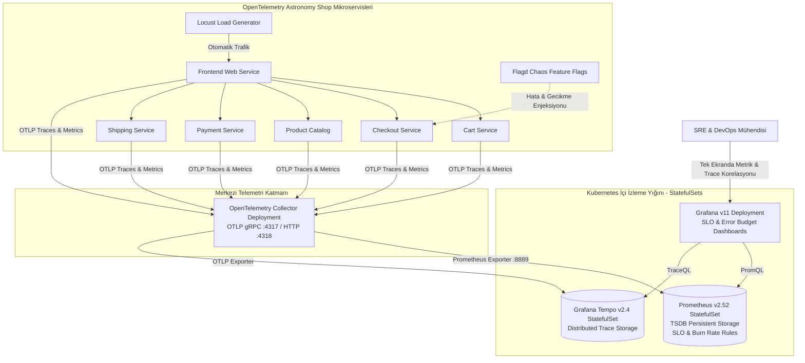

# OpenTelemetry Astronomy Shop — Enterprise SRE, SLO/SLI & Distributed Tracing Platform

Bu proje, Cloud Native Computing Foundation (CNCF) resmi **OpenTelemetry Astronomy Shop** mikroservis mimarisini temel alan; Google SRE el kitabına uygun **Hizmet Seviyesi Hedefleri (SLO)**, **Hata Bütçesi (Error Budget)**, **Çok Pencereli Hızlı/Yavaş Tüketim (Multi-Window Multi-Burn-Rate) Alarmları** ve **Dağıtık İzleme (Distributed Tracing)** pratiklerini hayata geçiren ileri düzey bir SRE & Gözlemlenebilirlik platformudur.

---

## 🏛️ Mimari ve Telemetri Akışı



---

## 📐 SRE Prensipleri ve SLO/SLI Matematiksel Modeli

### 1. Erişilebilirlik Hedefi (Availability SLO: %99.9)
* **Hizmet Seviyesi Göstergesi (SLI):** Son 30 günlük kayan pencerede başarılı (5xx olmayan) HTTP isteklerinin toplam isteklere oranı.
  $$\text{Availability SLI} = 1 - \frac{\sum \text{rate}(http\_requests\_total\{status=\sim"5.."\}[\text{30d}])}{\sum \text{rate}(http\_requests\_total[\text{30d}])}$$
* **Hata Bütçesi (Error Budget):** Toplam isteklerin azami `%0.1`'i (1000 istekte 1 hata) başarısız olabilir.

### 2. Gecikme Hedefi (Latency SLO: p95 < 500ms)
* **SLI:** Checkout işlemlerinin `%95`'i 500 milisaniyenin altında tamamlanmalıdır.
  $$\text{Latency SLI} = \text{histogram\_quantile}(0.95, \sum \text{rate}(http\_request\_duration\_seconds\_bucket\{job="checkoutservice"\}[5m]))$$

### 3. Çok Pencereli Tüketim Hızı Alarmları (Multi-Window Multi-Burn-Rate)
Geleneksel eşik alarmları yerine, hata bütçesinin tükenme hızına göre akıllı alarmlar kullanılır:
* **Critical Burn Rate (14.4x Tüketim):** 1 saat içinde aylık hata bütçesinin `%2`'si tükeniyorsa, nöbetçi mühendise (On-Call SRE) derhal çağrı (PagerDuty) düşer.
* **Warning Burn Rate (6x Tüketim):** 6 saat içinde bütçenin `%5`'i tükeniyorsa, mesai saatleri içinde incelenmek üzere bilet (Jira ticket) açılır.

---

## 🚀 Hızlı Başlangıç & Adım Adım Kurulum

### 1. Ön Koşullar
* Çalışan bir Kubernetes kümesi (`kind`, `k3s` veya `AWS EKS`)
* `kubectl` (v1.28+)
* `helm` (v3.12+)

### 2. SRE ve Observability Altyapısını Kurma
Tüm StatefulSet'leri (Prometheus, Tempo), OpenTelemetry Collector'ı ve Grafana'yı tek komutla kurun:

```bash
chmod +x scripts/*.sh
./scripts/deploy-sre-platform.sh
```

Kurulumu doğrulayın:
```bash
kubectl get statefulsets,pods -n monitoring
kubectl get pods -n opentelemetry
kubectl get pods -n astronomy-shop
```

### 3. Grafana SLO Panosuna Erişim
```bash
kubectl port-forward svc/grafana -n monitoring 3000:3000
```
* **URL:** `http://localhost:3000`
* **Kullanıcı:** `admin`
* **Şifre:** `BilgincIT454`
* **Pano:** *Dashboards -> E-Commerce SRE Service Level Objectives (SLO) & Error Budgets*

### 4. Canlı Kaos Mühendisliği ve Hata Bütçesi Yakma Deneyi
Sisteme yapay HTTP 500 hataları göndererek hata bütçesi ibresinin nasıl düştüğünü ve alarmın nasıl tetiklendiğini anlık izleyin:

```bash
./scripts/chaos-error-spike.sh 60 15
```
Grafana panosunda:
1. **Remaining Error Budget** ibresinin hızla yeşilden sarıya/kırmızıya düştüğünü,
2. **Current Burn Rate** göstergesinin `14.4x` kritik seviyesine fırladığını,
3. **Prometheus Alerts** sekmesinde `ErrorBudgetBurnRateCritical` alarmının tetiklendiğini gözlemleyin.

### 5. Dağıtık İzleme (Distributed Tracing - Tempo)
Grafana üzerinde **Explore -> Tempo** sekmesine geçerek herhangi bir yavaş isteğin `Trace ID`'sini inceleyin; isteğin Frontend -> Checkout -> Payment -> Shipping servisleri arasında kaçar milisaniye harcadığını mikrosaniye hassasiyetinde görün.

---

## ☁️ Modüler AWS Altyapısı (Terraform)

Bu projeyi AWS EKS üzerinde çalıştırmak istediğinizde, aynı modüler Terraform kodlarını ortam tfvars dosyalarıyla tek komutla ayağa kaldırabilirsiniz:

```bash
cd terraform
terraform init
terraform apply -var-file="environments/dev.tfvars"
```

Temizlik için:
```bash
terraform destroy -var-file="environments/dev.tfvars"
```

---

## 🔧 Dizin Yapısı

```text
.
├── sre-slo/
│   └── 01-slo-definitions.yaml     # PrometheusRule Availability & Latency SLO kuralları
├── observability/
│   ├── 01-prometheus-statefulset.yaml # Prometheus TSDB StatefulSet & PVC
│   ├── 02-tempo-statefulset.yaml      # Grafana Tempo Distributed Traces StatefulSet
│   ├── 03-grafana-deployment.yaml     # Grafana Deployment & Datasource tanımları
│   ├── 04-otel-collector-deployment.yaml # OTel Collector Pipeline Deployment
│   └── dashboards/
│       └── grafana-slo-dashboard.json # İleri SRE SLO & Error Budget Panosu
├── terraform/
│   ├── modules/ (vpc, eks)         # Reusable AWS Modülleri
│   ├── environments/               # dev.tfvars, staging.tfvars, prod.tfvars
│   ├── main.tf, variables.tf       # Modüler Terraform yapısı
│   └── backend.tf                  # Dinamik tfstate backend
├── scripts/
│   ├── deploy-sre-platform.sh      # Tek tıkla tüm yığını kurma betiği
│   ├── chaos-error-spike.sh        # Hata bütçesi yakma kaos testi
│   └── validate.sh                 # Otomatik SRE doğrulama testi
└── README.md                       # SRE Operasyon ve Eğitim Kılavuzu
```

---

## 📞 Destek ve Katkı
Bu proje DevOps Atölyesi Eğitim Programı kapsamında hazırlanmıştır. Sorularınız için eğitim kanalından veya eğitmeninizle iletişime geçebilirsiniz.
